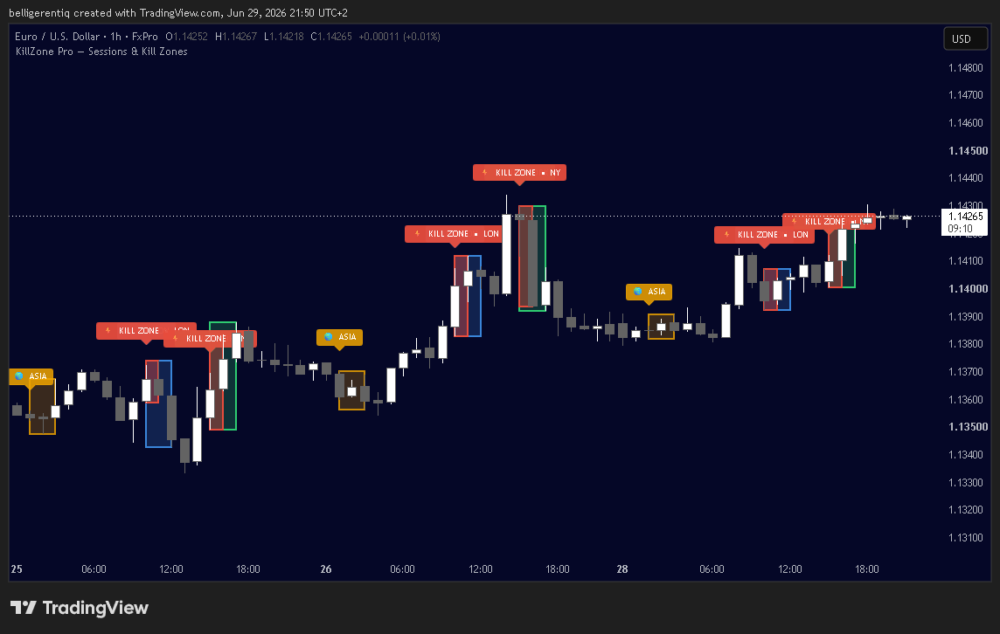
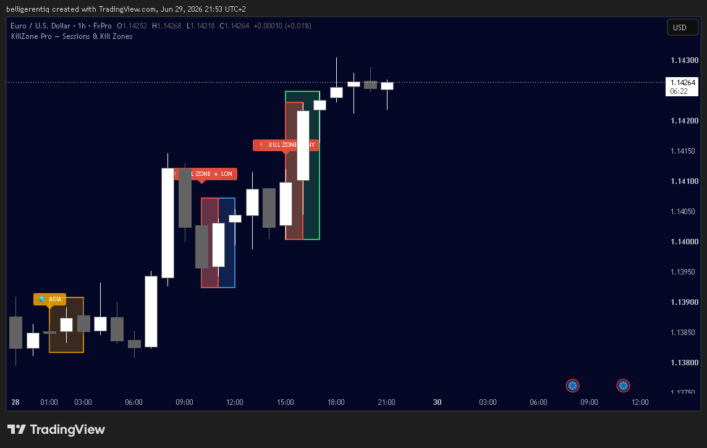
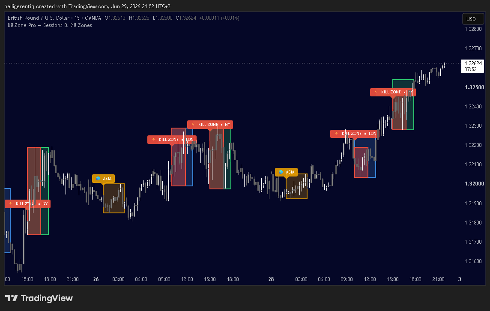
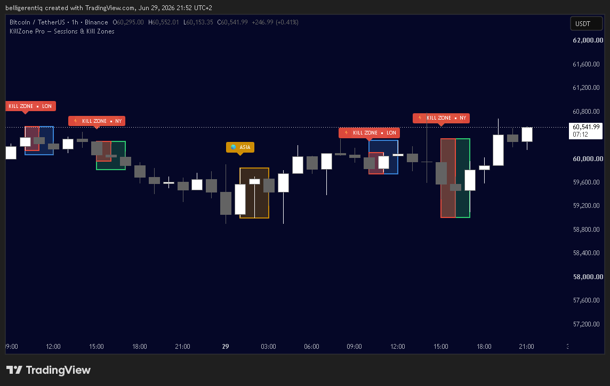

# ⚡ KillZone Pro — Session Highlighter & ICT Kill Zones

> Free TradingView indicator built in Pine Script v6

## What is this?

KillZone Pro automatically highlights the 4 major trading sessions 
and ICT Kill Zones directly on your chart.

Never trade at the wrong time again.

## Sessions & Kill Zones

| Zone | Time (UTC) | Color |
|------|-----------|-------|
| 🌏 Asia Session | 23:00 – 02:00 | Yellow |
| 🇬🇧 London Session | 08:00 – 11:00 | Blue |
| 🗽 New York Session | 13:00 – 16:00 | Green |
| ⚡ Kill Zone LON | 08:00 – 10:00 | Red |
| ⚡ Kill Zone NY | 13:00 – 15:00 | Red |

## Screenshots

## How to use

1. Open TradingView Pine Script Editor
2. Copy the code from `KillZonePro.pine`
3. Click "Add to chart"
4. Customize colors in Settings

## Features

- ✅ Works on Forex, Crypto, Indices, Futures
- ✅ Fully customizable colors
- ✅ Auto-labels on every session open
- ✅ Clean minimal design
- ✅ Works on all timeframes (1H, 15M, 5M recommended)

## Pro Version (coming soon)

- 🔒 Built-in alerts (session open/close)
- 🔒 Custom session time inputs  
- 🔒 Countdown timer to next Kill Zone

> Pro access will be available via [Whop](#)

## Disclaimer

For educational and analytical purposes only.  
This is not financial advice.  
Past performance does not guarantee future results.

## Author

Built by [@belligerentiq](https://github.com/belligerentiq)  
TradingView: [belligerentiq](https://www.tradingview.com/u/belligerentiq/)